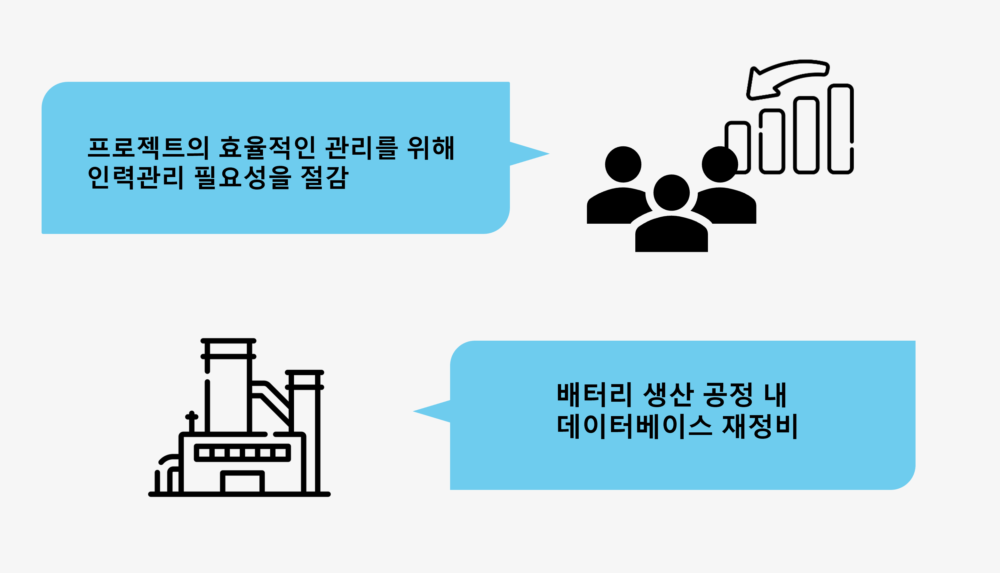

# PDM

## 프로젝트 소개

프로젝트 개요/동기
  

 

## 기술 스택

| Oracle | 
| :--------: | 
|   ![oracle]    |   

 

## 구현 기능

### 각 테이블 별 관계도
 

 
### 공정 내 순이익
 

 
### 각 직급 별 월급
 

 

## 배운 점 & 아쉬운 점

  Join문에 대한 이해도가 올라갔었고, 시각을 다르게 하면 SQL Query 또한 색다르게 구현이 가능하다는 점을 배울 수 있는 시간이었습니다.

  

  웹페이지로 연결하는 프로젝트가 아니었기에 실제 웹 페이지를 구성하여 Data가 전송되는 것을 볼 수 없었다는 점이 아쉬웠습니다.

 

## 라이센스

MIT &copy; [NoHack](mailto:lbjp114@gmail.com)

<!-- Stack Icon Refernces -->

[oracle]: /images/stack/oracle.svg
